## Executive Summary

The **Harness CCM FinOps Agent** is a Model Context Protocol (MCP) server that turns a customer's live cloud-billing, budget, recommendation, commitment, and governance data into **conversational FinOps workflows**. Any LLM-powered client (Claude Desktop, Cursor, ChatGPT apps, a Harness-native chat UI, an internal AI co-pilot) can connect to it and drive the same deterministic, audit-safe operations that the CE product UI exposes — without the user having to navigate a dashboard.

This document is written for **Harness product and engineering**. It covers:

1. The **thirteen use cases** the agent supports today — each with a product description, the customer value it delivers, an illustrative screenshot, and the precise implementation that Harness engineering would need to integrate into the product.
2. The **architecture** of the MCP server — how tools, registry, client, and renderer fit together.
3. An **integration roadmap** — the minimum surface area product needs to stand up a native agent experience inside the Harness platform.

::: metrics
- label: Use cases covered
  value: "13"
  trend: Visibility → Maturity → Training
  tone: success
- label: MCP tools registered
  value: "12"
  trend: Registry-driven + standalone
  tone: info
- label: Resource types available
  value: "20+"
  trend: cost_*, commitment_*, autostopping_*
  tone: info
- label: Deployment modes
  value: "2"
  trend: stdio + streamable HTTP
  tone: success
:::

::: info What this report is not
This is **not** the agent's user-facing guide (that lives in `src/docs/finops-guide.md` and is returned by the `harness_ccm_finops_guide` tool). It is a **product & engineering brief** meant to answer "what does the agent do, why do customers love it, and how would we integrate it into the Harness platform?"
:::

### Screenshot — this very document, rendered by the agent

The cover page below was rendered from the same markdown you are reading, by the `harness_ccm_finops_report_render` tool, in the default `harness` theme. All other screenshots in this brief are captured the same way — there is no separate design system, no second codebase.

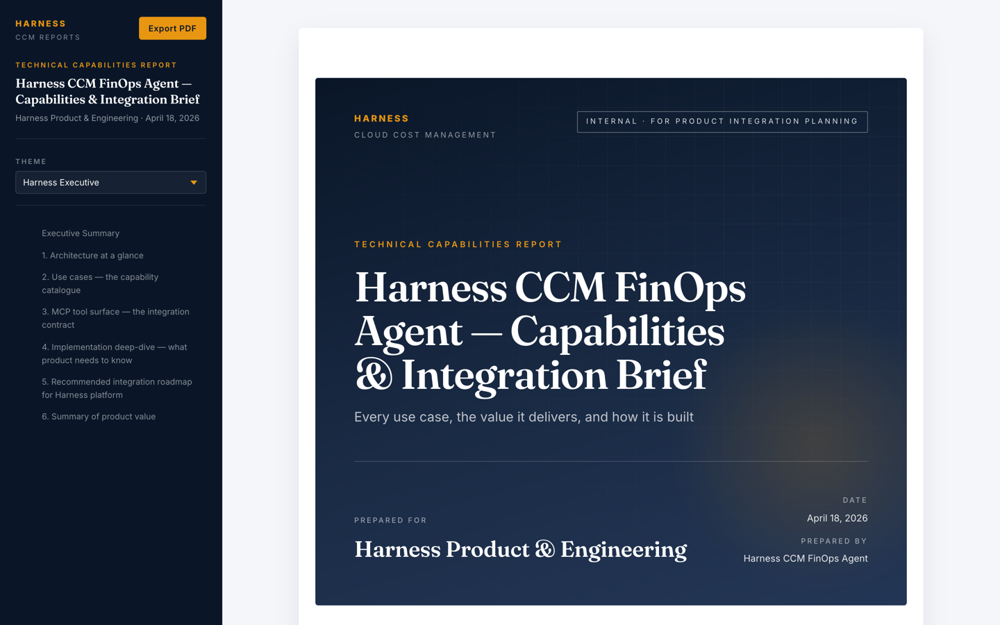

---

## 1. Architecture at a glance

The FinOps Agent is a Node 20+ TypeScript service that speaks **MCP** over two transports. Everything else — tools, registry, HTTP client, report renderer — is composed inside a single process.

```text
+---------------------------------------------------------------+
|               MCP Client (Claude, Cursor, Harness UI)         |
+---------------------------------------------------------------+
        |  stdio  OR  POST /mcp (streamable HTTP)
        v
+---------------------------------------------------------------+
|  McpServer   ──  12 registered tools                          |
|      │                                                        |
|      ├─ registry-driven tools  (list / get / describe)        |
|      │       └─  Registry  ──  ccm toolset                    |
|      │                           └─ 20+ ResourceDefinitions   |
|      │                                                        |
|      ├─ standalone query tools (json, chart, cost_category    |
|      │       period chart, budget health, maturity chart)     |
|      │                                                        |
|      └─ report tools (report_render, markdown_to_pdf, guide,  |
|               curriculum)                                     |
+---------------------------------------------------------------+
        |                                    |
        |  HarnessClient                     |  in-process
        v                                    v
+------------------------+    +------------------------------------+
|  Harness CCM + CO APIs |    |  Report Renderer (Express routes)  |
|  /ccm/api/*, /lw/co/*  |    |  serves /reports/<id>/             |
|  (GraphQL + REST)      |    |  themes + PDF export via Playwright|
+------------------------+    +------------------------------------+
```

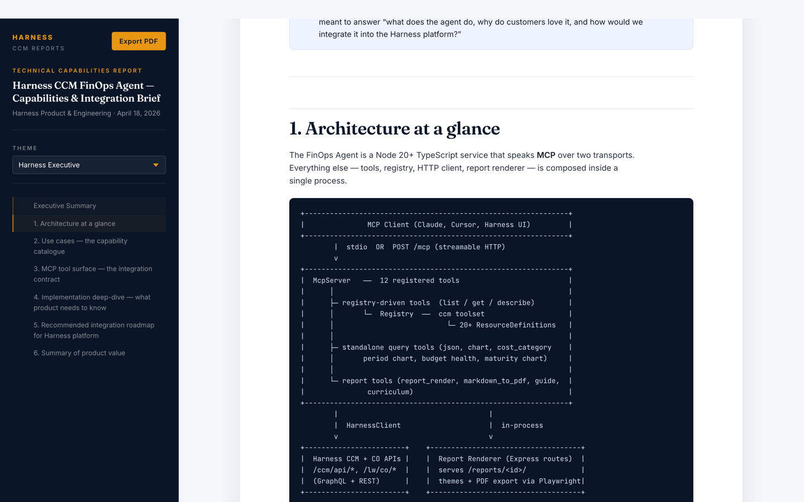

Key engineering properties:

- **Registry-driven.** All CCM resource types (`cost_perspective`, `cost_breakdown`, `cost_recommendation`, `cost_budget`, `cost_commitment_summary`, `cost_autostopping_rule`, …) are declared once in `src/registry/toolsets/ccm.ts`. The three generic tools (`harness_ccm_finops_list`, `…_get`, `…_describe`) dispatch any call to the right endpoint without per-resource code. Adding a new resource is **one entry** in the toolset file.
- **Deterministic by design.** Tools are strongly typed (Zod), read-only by default (`HARNESS_READ_ONLY`), and return structured JSON. The LLM decides *what* to call; the server decides *how*.
- **Session-based HTTP transport.** The `/mcp` endpoint is DNS-rebind-protected, rate-limited per-IP, and maintains per-session state with TTL eviction. Health via `GET /health`.
- **Report renderer is in-process.** No second service. Markdown + assets in → themed HTML out → Playwright-driven PDF on demand.

---

## 2. Use cases — the capability catalogue

Each section below follows the same shape: **What it does → Why customers care → How it is implemented**. Screenshots show representative output generated by the agent against a live Harness CCM account.

---

### Use case 1 — Discovery & bootstrap

**What it does.** The agent's first call in every session is `harness_ccm_finops_list` with `resource_type: cost_metadata`. It returns which clouds are connected, default perspective IDs, data-presence flags, and the account's currency. This single call conditions every subsequent query so the agent never asks for data that isn't wired up.

**Customer value.**
- Zero setup — the agent self-configures per account in one round-trip.
- Prevents "why is this empty?" dead ends (queries against disconnected clouds are never issued).
- Multi-tenant safe: the LLM never sees raw credentials or account IDs, only the server-resolved perspective IDs for the current session.

**Implementation.**
- Resource: `cost_metadata` → Harness GraphQL `ccmMetaData` query.
- Tool: `harness_ccm_finops_list` (registry-driven).
- File: `src/registry/toolsets/ccm.ts` (look for `cost_metadata`).
- Product integration: the Harness UI already calls this via `useCCMMetadata()`. A native agent surface can re-use the same query hook — no new backend work required.

---

### Use case 2 — Cost visibility across clouds

**What it does.** The agent can describe total spend per cloud, then break it down by service, account, region, BU, SKU, or tag — all via one resource type (`cost_breakdown`) with a `group_by` dimension. It automatically filters AWS line-item noise (`filter_aws_line_item_type: "Usage"`) so breakdowns never include RIFee / Savings-Plan artifacts that would pollute the narrative.

**Customer value.**
- A finance analyst can go from **"How much are we spending?"** to **"On what? In which account? Which BU?"** without leaving the chat.
- One call returns both the current period total **and** the `costTrend` vs the prior equal-length window — no second query required.
- AWS "No Service" and negative-trend artifacts are filtered server-side, eliminating the #1 support ticket source in ad-hoc CCM analyses.

**Screenshot — AWS top services (live data):**

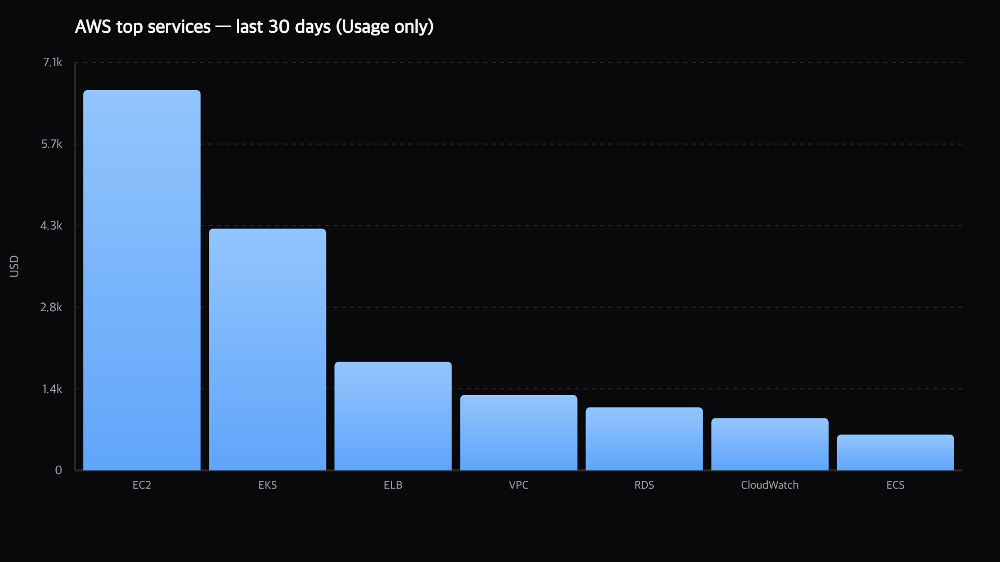

**Screenshot — Total spend by cloud:**

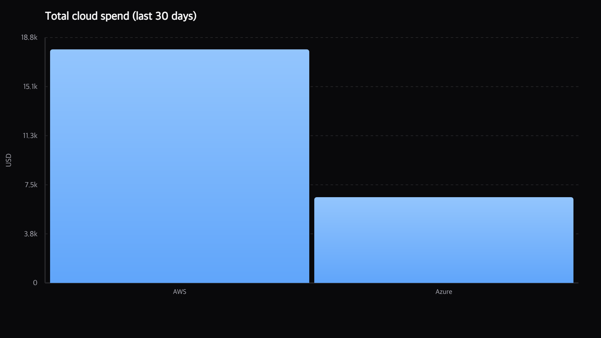

**Implementation.**
- Resources: `cost_breakdown`, `cost_summary`, `cost_timeseries` (all three accept the same `group_by` / `filter_*` / `business_mapping_name` vocabulary).
- Dispatcher: `Registry.dispatch` in `src/registry/index.ts` — a single `executeSpec` handles GraphQL body construction, `filter_aws_line_item_type` pass-through, and business-mapping UUID resolution.
- Chart: rendered locally in-process via `@napi-rs/canvas` in `harness_ccm_finops_chart` — the model does not upload images anywhere, it passes a JSON `chart_spec` and the server returns a PNG.
- Product integration: the CE module already exposes these GraphQL queries. To wire them into a native agent, product needs to (a) proxy the query through an agent-facing gateway, (b) reuse the "Usage-only" filter helper the MCP server uses (`src/registry/toolsets/ccm.ts`).

---

### Use case 3 — Cost allocation & business mappings

**What it does.** The agent discovers the customer's cost categories (Business Units, Business Domains, Teams, Products…), picks the primary BU mapping, and can compute the **allocated vs unattributed** split, rank BUs by spend, and drill into a single BU across services or accounts — all with `filter_cost_category_value` + `business_mapping_name`.

**Customer value.**
- Answers the single most important FinOps question — **"Who owns this dollar?"** — in plain English, with a chart, in under 10 seconds.
- Identifies the **unattributed gap** (the biggest killer of FinOps maturity) and explains it in the same breath.
- Bridges from allocation to accountability: the agent can instantly pivot from a BU leaderboard to the open recommendations for the top-spending BU.

**Implementation.**
- Resource: `cost_category` (list returns name + uuid; `get` returns the full rule tree).
- Special-case logic in `Registry.dispatch` resolves business-mapping **names → UUIDs** once per call (`resolveBusinessMappingForGroupBy` in `src/registry/ccm-business-mapping-resolve.ts`), so the LLM can pass human-readable names like `"Business Units"` and the server translates them to the 22-character field ID the GraphQL API expects.
- Product integration: this name-resolution step is the key UX unlock. Product should expose it as a generally-available helper (not only inside the agent) so other AI surfaces — reports, chat widgets, voice — don't reinvent it.

---

### Use case 4 — Daily trend & period comparison

**What it does.** `cost_timeseries` returns a daily / weekly / monthly series grouped by any dimension. The agent always renders it as a line chart and calls out the **data-lag** pitfall (the last calendar day is typically partial).

**Customer value.**
- Trends are **shape-first**: the chart answers "when did it start?" in half a second, which a table of numbers cannot.
- The deterministic data-lag warning prevents the classic false-alarm incident where a user panics about a cost drop that is just an incomplete day.
- Dramatically cheaper for reviews than ad-hoc dashboard filtering.

**Screenshot:**

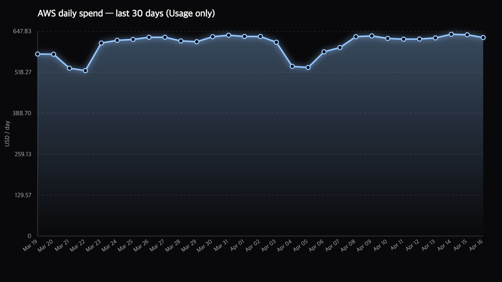

**Implementation.**
- Resource: `cost_timeseries`.
- `time_resolution`: `DAY | WEEK | MONTH`.
- Chart rendering: same in-process canvas pipeline as use case 2; the report renderer inlines the PNG into the HTML at export time.
- Product integration: if the Harness platform wants a native "show me the last 30 days" button, it already has the query. Wrapping the output in a stable PNG endpoint is a port of `src/utils/chart-renderer.ts` (not currently exposed as a public API) — the chart pipeline is already deterministic and dependency-free.

---

### Use case 5 — Cost spike / anomaly investigation

**What it does.** Two mechanisms, one mental model.
- **Spike investigation** — a six-step deterministic pattern (§6 of `src/docs/finops-guide.md`): lock the question → coarse trend → owner drill (project/account) → SKU/line-item delta → daily series → chart. Works identically on AWS and GCP via a cloud cross-reference table the agent internalises.
- **Anomaly triage** — three calls (`cost_anomaly_summary` → `cost_anomaly` list → `cost_anomaly` get) that take the user from "are there anomalies?" to "here is the specific anomaly record and its daily breakdown" without ever touching a dashboard.

**Customer value.**
- Incident-response collapses from 30–45 minutes of dashboard archaeology to a 90-second chat exchange.
- Repeatable across customers: because the pattern is codified in the guide (returned by `harness_ccm_finops_guide`), every agent session applies the same investigation rubric. No tribal knowledge required.
- False-positive feedback loops are supported — the agent can surface anomalies marked as expected.

**Implementation.**
- Resources: `cost_anomaly_summary`, `cost_anomaly` (supports both `list` and `get`).
- Guide: `src/docs/finops-guide.md` §6 + §7 are the canonical "how to" used by the LLM. Any change to investigation methodology is a markdown edit, not a code change.
- Product integration: the anomaly subsystem already has its own API surface. The *value* the agent adds is the **sequence orchestration** — stringing three queries together into a coherent narrative. That orchestration is what product needs to port into a native experience; see `harness_ccm_finops_guide.ts` for the packaging pattern.

---

### Use case 6 — Savings recommendations

**What it does.** Lists open recommendations across EC2, Azure VM, ECS, Workloads, Node Pools, and Governance resources, with rich filters — by perspective, BU, cloud, region, account, tag, or governance rule. JIRA / ServiceNow noise is stripped server-side. The agent sorts by `monthlySaving`, annualises the top N, and can drill into any single recommendation for resource-level detail.

**Customer value.**
- Converts a list of 500 noisy alerts into a focused "top 10 opportunities this month" conversation.
- Per-BU drill-down lets a platform team walk into a partner team's sprint review with a pre-prioritised savings list tied to *their* resources.
- Works equally well for governance (policy-as-code) and right-sizing — one resource type, one filter vocabulary.

**Implementation.**
- Resource: `cost_recommendation` (`list` + `get`).
- Registry filter spec: 15+ fields (`resource_type_filter`, `cloud_provider`, `cost_category_*`, `tag_*`, etc.) declared declaratively — no bespoke handler per filter.
- Product integration: the filter spec is the hardest earned piece. Product can copy `src/registry/toolsets/ccm.ts#costRecommendation` verbatim to expose the same filter grammar to any non-MCP surface (REST gateway, GraphQL layer, chat widget).

---

### Use case 7 — Budgets, health sweep, and forecasting

**What it does.** Two complementary primitives.

1. **Raw access** — `cost_budget` list + get returns `actualCost`, `budgetAmount`, `forecastCost`, `timeLeft`, `actualCostAlerts`, `forecastCostAlerts`, and a `costData[]` time series (month-by-month variance).
2. **Pre-classified health sweep** — `harness_ccm_finops_budget_health` runs the list, buckets every budget into `over_budget | at_risk | on_track | skipped`, and sorts each bucket by severity. One call = the entire FinOps health check.

**Customer value.**
- "Which budgets are at risk this month?" is answered in a single call, not a 30-minute scripting session.
- Each at-risk item already carries `perspective_id`, so the agent can pivot directly to a cost-breakdown drill-down with no extra lookup.
- The classification rules are deterministic, which means the same question asked twice gives the same answer — critical for executive-facing reporting.

**Screenshot — budget classification:**

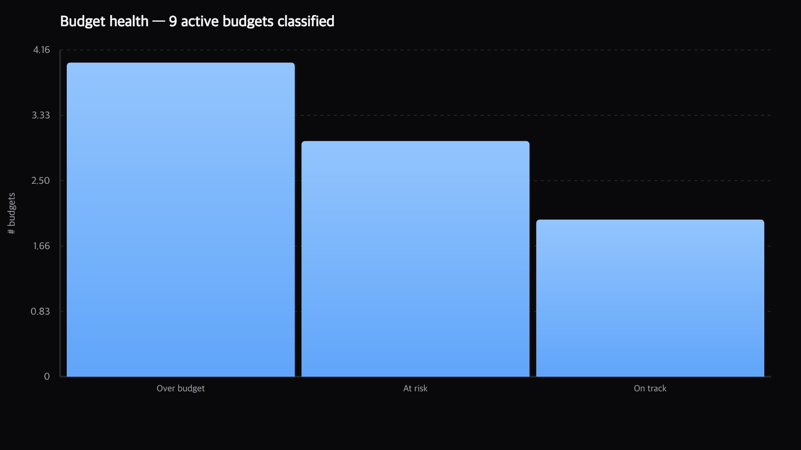

**Screenshot — at-risk detail chart:**

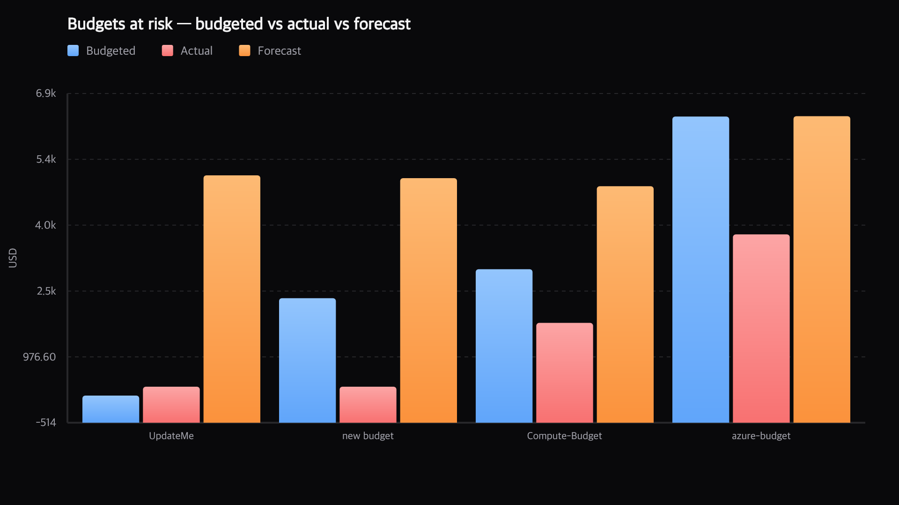

**Implementation.**
- Resources: `cost_budget` (registry-driven).
- Standalone tool: `harness_ccm_finops_budget_health` (`src/tools/harness-ccm-budget-health.ts`) — 200 lines that call the same list and apply the classification.
- Product integration: this is the **highest-leverage helper** in the whole server. Product should make it a first-class CCM endpoint (`GET /ccm/api/budget-health?…`). That one endpoint unlocks every chat / voice / email / Slack summary integration customers ask for.

---

### Use case 8 — Perspective folders (team-scoped analysis)

**What it does.** A three-step pattern — `cost_perspective_folder` list → `cost_perspective` filtered by `folder_id` → `harness_ccm_finops_budget_health` filtered by perspective names — answers **"How is Team X doing?"** without the user having to remember every one of their perspective names.

**Customer value.**
- Teams with 20+ perspectives finally have a clean abstraction: "show me my folder" instead of "show me all 20 perspectives by name".
- Platform teams can answer "is Payments on track?" from the folder name alone.

**Implementation.**
- Resource: `cost_perspective_folder` (list only — folders are CE platform objects, not CCM analytics objects).
- The folder UUID → perspective-name resolution happens client-side in the agent's turn, so no new API is required on the CCM backend.
- Product integration: folders are already a platform concept. The agent demonstrates that a simple "folder filter" added to the existing budget-health endpoint gives customers enormous ergonomic win.

---

### Use case 9 — Commitment Orchestration (RI & Savings Plans)

**What it does.** Eight resource types cover the entire CO surface: `cost_commitment_summary`, `cost_commitment_coverage`, `cost_commitment_savings`, `cost_commitment_utilisation`, `cost_commitment_savings_overview`, `cost_commitment_filters`, `cost_commitment_accounts`, `cost_commitment_analysis`. The agent runs the canonical six-step health check (summary → coverage → savings → utilisation → managed-vs-unmanaged → payer accounts) and flags the three failure modes (coverage < 90%, utilisation < 80%, RDS/ElastiCache uncovered).

**Customer value.**
- Surfaces the **RDS gap** — the single biggest untapped CO opportunity at most customers, hidden because the default view is EC2-centric.
- Quantifies ROI instantly: *on-demand spend × ~40% RI discount rate = annualised opportunity*.
- Utilisation below 80% is flagged as waste **before** expansion is recommended — prevents customers buying more RIs on top of under-used ones.

**Screenshot — current coverage split (illustrative):**

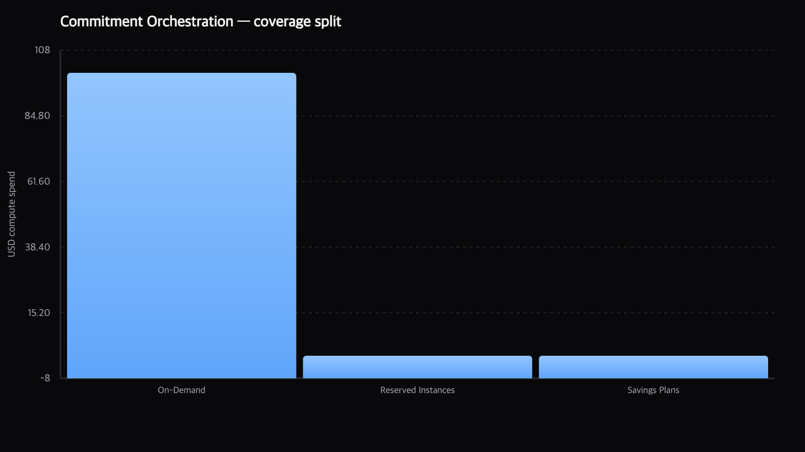

**Implementation.**
- Endpoints: all under `/lw/co/api/*` (Lightwing), declared as registry resources with explicit date formatting rules (`YYYY-MM-DD`).
- The six-step sequence is codified in `src/docs/finops-guide.md` §14 — the LLM follows it exactly each time.
- Product integration: the endpoint surface already exists; the integration gain is the **sequence** — wrapping the canonical health check into a single "CO health check" endpoint would let the Harness UI render a live dashboard with zero per-query logic.

---

### Use case 10 — AutoStopping (idle resource management)

**What it does.** Rule inventory, cumulative savings, per-rule daily savings, activity logs, and schedules — all routed through six registry-driven resource types. The agent will happily answer "how much did AutoStopping save us last month?", "which rules cycle most frequently?", and "which BUs have no coverage?"

**Customer value.**
- Monthly savings run-rate becomes a one-call question instead of a dashboard dive.
- Rule-level diagnostics (errors, frequent cycling = `idle_time_mins` too low) surface as part of the same conversation — catching misconfigured rules before they cost customers uptime.

**Screenshot — AutoStopping daily savings (live data):**

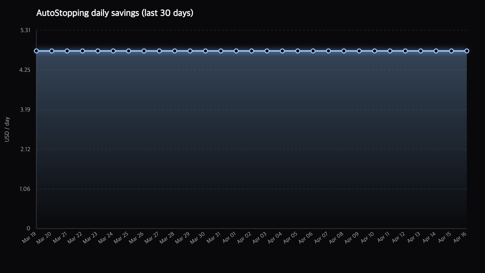

**Implementation.**
- Resources: `cost_autostopping_rule`, `cost_autostopping_savings`, `cost_autostopping_savings_cumulative`, `cost_autostopping_logs`, `cost_autostopping_schedule`.
- Two different date formats are handled transparently (YYYY-MM-DD for cumulative; Unix-seconds for per-rule) — the registry declares the difference so the LLM never has to guess.
- Product integration: same story as CO — endpoints exist, the sequencing and date-format normalisation are the value add.

---

### Use case 11 — FinOps Maturity assessment & spider chart

**What it does.** The agent can score an account on **seven dimensions** (Visibility, Allocation, Tooling, Commitment Strategy, Anomaly Detection, Optimization, Accountability), grouped into the three FinOps pillars (Inform, Optimize, Operate). Scores come from evidence pulled via the other use cases, applied against a deterministic rubric (§17 of the guide). The `harness_ccm_finops_maturity_chart` tool renders the radar with group sub-scores and an overall Crawl/Walk/Run label.

**Customer value.**
- Executives get a **one-image maturity snapshot** backed by the customer's own data — no consultant hours.
- The rubric removes subjectivity: two different reviewers hitting the same account land on the same score.
- The chart drops straight into any Business Value Review — and Harness AE teams use it as the central artefact of quarterly reviews.

**Screenshot:**

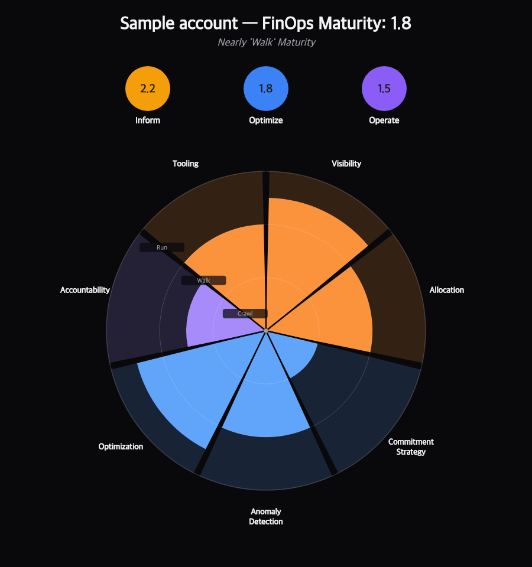

**Implementation.**
- Tool: `harness_ccm_finops_maturity_chart` (`src/tools/harness-ccm-maturity-chart.ts`).
- Rendering: grouped radar with per-dimension colour coding (Inform = orange, Optimize = blue, Operate = purple). All drawing is local canvas — no external rendering service.
- Scoring rubric: `src/docs/finops-guide.md` §17 — pure markdown, editable in a PR.
- Product integration: the scoring rubric is the product. Shipping it as a shared config (TOML / YAML / rule engine) — consumable by both the agent and a hypothetical in-product "Maturity Dashboard" — is the cleanest path.

---

### Use case 12 — Business Value Review rendering

**What it does.** The `harness_ccm_finops_report_render` tool takes any markdown file (with YAML frontmatter, `:::callout` blocks, `::: metrics` cards, and `` references), registers it with the in-process report renderer, and returns a pinned URL the user can open in the browser. Four themes ship out-of-the-box (`harness`, `modern`, `glass`, `kinetic`). A single click in the browser exports a paginated PDF via Playwright/Chromium.

**Customer value.**
- BVRs go from **Days** to **minutes**.
- The same BVR is viewable four different ways — executive (harness), editorial (modern), showpiece (glass), or scrollytelling (kinetic) — without re-authoring.
- The report URL is stable per `id`, so teams bookmark it and re-run the same prompt a quarter later to get the refreshed numbers at the same URL.

**Screenshot — same markdown, three alternative themes:**

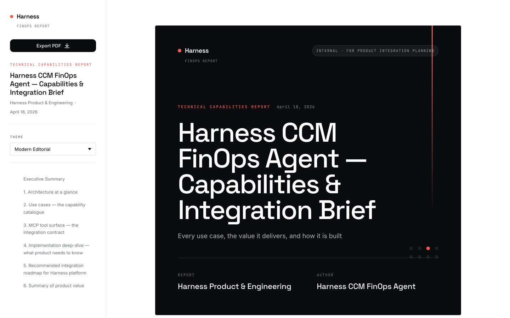

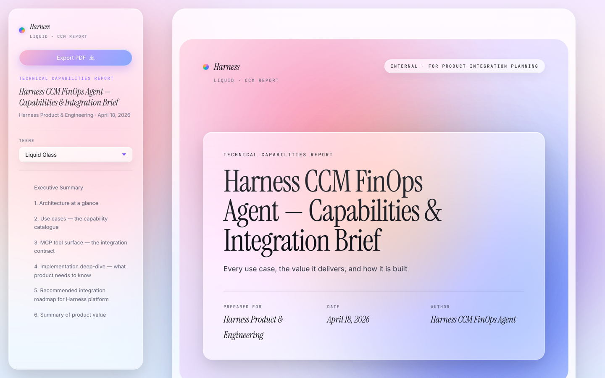

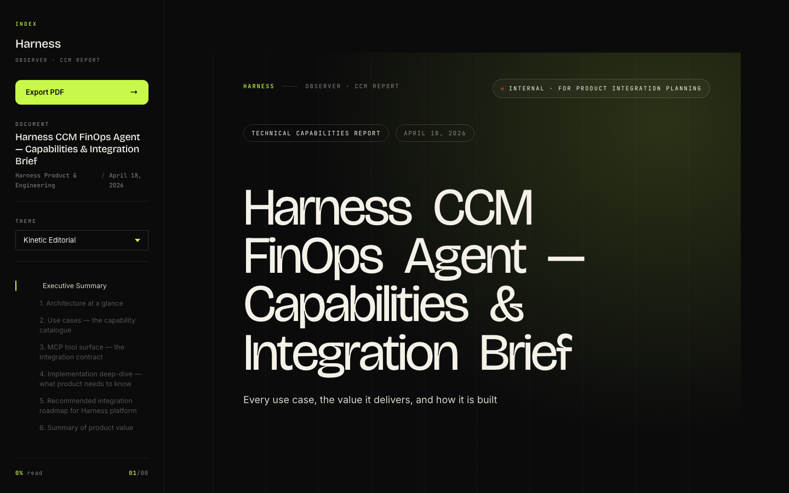

**Screenshot — mid-document reading experience (Harness theme):**

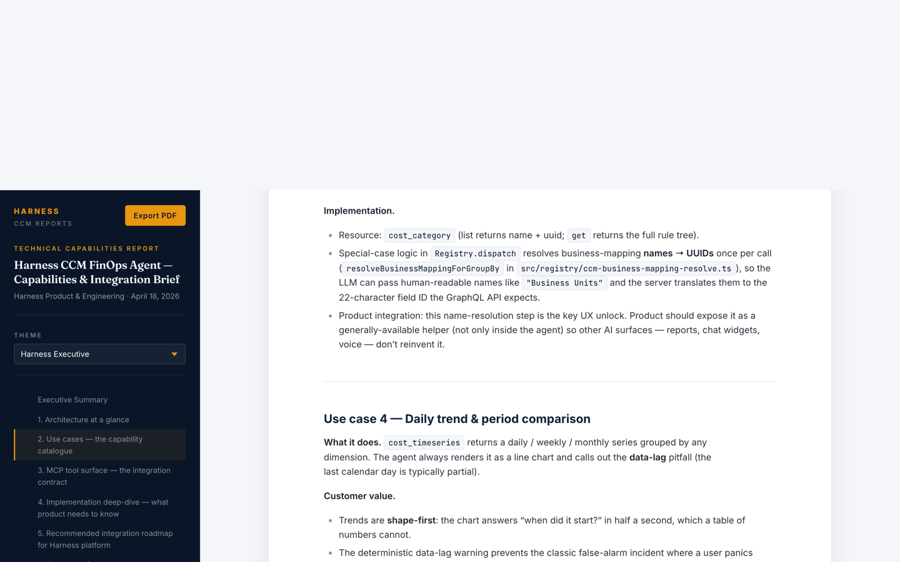

**Implementation.**
- Tool: `harness_ccm_finops_report_render` (`src/tools/harness-ccm-report-render.ts`).
- Renderer: in-process Express routes mounted on the same port as the MCP HTTP endpoint (`src/report-renderer/index.ts`). The markdown file's directory becomes the web root for that report, so any relative asset reference (`assets/…`, `images/…`, `bare.png`) resolves off disk without extra config.
- PDF: Playwright-driven print preview from the same HTML view — zero DOM drift between browser view and PDF.
- Product integration: this is the other high-leverage capability. Standing up an equivalent renderer inside the Harness platform (one Express route + a theme stylesheet + Playwright) would let every AI-generated artefact land at a permalink URL — chat replies, Slack summaries, scheduled reports, emails. The agent demonstrates the pattern end-to-end.

---

### Use case 13 — FinOps Fluency training curriculum

**What it does.** The newest tool — `harness_ccm_finops_curriculum` — returns a complete **7-lesson FinOps-training playbook** keyed off the customer's live bill. Each lesson follows the same five-beat teaching rhythm (Hook → Zoom → Reveal → Pattern → Practice), is built from the customer's own data (no synthetic examples, no "Acme Corp"), and renders as a themable lesson page via the same report renderer.

**Customer value.**
- Turns FinOps from a **one-off BVR** into an ongoing customer training programme — driving product stickiness and deeper CCM adoption without human-delivered training time.
- Every lesson cross-references other tools ("Your turn" prompts seed the next session), building a guided learning graph that mirrors the FinOps Foundation's Inform → Optimize → Operate framework.
- The curriculum is the same whether the customer has $1M or $100M on cloud — the numbers change, the pedagogy doesn't.

**Implementation.**
- Tool: `harness_ccm_finops_curriculum` (`src/tools/harness-ccm-finops-curriculum.ts`, registered in `src/tools/index.ts`).
- Content: `src/docs/finops-lessons.md` — copied to `build/docs/` at build time by the `build:copy-assets` script in `package.json`.
- Render path: each lesson is its own directory under `finops-training/lesson-<NN>-<slug>/` with 3–5 PNGs plus a `lesson.md`, rendered via `harness_ccm_finops_report_render` with a stable `id` so each lesson becomes a deep-linkable permalink (e.g. `…/reports/acme-finops-fluency-lesson-03/`).
- Product integration: this is a net-new customer-facing motion. Making it a first-class thing inside Harness (a "FinOps Academy" tab keyed off the customer's account) costs almost nothing — the content engine is already built.

---

## 3. MCP tool surface — the integration contract

There are **twelve registered tools**. The first three (list / get / describe) are generic entry points to 20+ registry resources; the remaining nine are purpose-built.

| Tool | Kind | What it does | Key file |
|:---|:---|:---|:---|
| `harness_ccm_finops_list` | registry | List any resource with filters / pagination / search / cost-category scoping | `src/tools/harness-list.ts` |
| `harness_ccm_finops_get` | registry | Fetch a single resource by ID | `src/tools/harness-get.ts` |
| `harness_ccm_finops_describe` | registry | Introspect the resource schema for the LLM | `src/tools/harness-describe.ts` |
| `harness_ccm_finops_json` | standalone | Run a raw CCM GraphQL query — escape hatch for advanced users | `src/tools/harness-ccm-json.ts` |
| `harness_ccm_finops_chart` | standalone | Render a bar / line / grouped-bar PNG from JSON points | `src/tools/harness-ccm-chart.ts` |
| `harness_ccm_finops_cost_category_chart` | standalone | Specialised period-vs-period chart across cost categories | `src/tools/harness-ccm-cost-category-period-chart.ts` |
| `harness_ccm_finops_budget_health` | standalone | Classified over/at-risk/on-track sweep across all budgets | `src/tools/harness-ccm-budget-health.ts` |
| `markdown_to_pdf` | standalone | Quick-and-dirty markdown → PDF for ad-hoc notes | `src/tools/markdown-to-pdf.ts` |
| `harness_ccm_finops_maturity_chart` | standalone | Seven-dimension radar with Crawl/Walk/Run labels | `src/tools/harness-ccm-maturity-chart.ts` |
| `harness_ccm_finops_report_render` | standalone | Register a markdown file, return a themed, pinned report URL | `src/tools/harness-ccm-report-render.ts` |
| `harness_ccm_finops_guide` | standalone | Return the full agent playbook — called at session start | `src/tools/harness-ccm-guide.ts` |
| `harness_ccm_finops_curriculum` | standalone | Return the 7-lesson training playbook | `src/tools/harness-ccm-finops-curriculum.ts` |

All tools are wired in `src/tools/index.ts`:

```typescript
export function registerAllTools(server, registry, client, config) {
  registerListTool(server, registry, client);
  registerGetTool(server, registry, client);
  registerDescribeTool(server, registry);
  registerCcmJsonTool(server, config);
  registerCcmChartTool(server, config);
  registerCcmCostCategoryPeriodChartTool(server, registry, client, config);
  registerCcmBudgetHealthTool(server, registry, client);
  registerMarkdownToPdfTool(server);
  registerCcmMaturityChartTool(server, config);
  registerCcmReportRenderTool(server, config);
  registerCcmGuideTool(server);
  registerCcmFinOpsCurriculumTool(server);
}
```

Adding a new tool is a two-line change: one import + one registration call. Adding a new **resource type** (e.g. a new CCM endpoint) is one entry in `src/registry/toolsets/ccm.ts` — no bespoke tool required.

---

## 4. Implementation deep-dive — what product needs to know

### 4.1 The registry pattern

Every resource is declared once as a `ResourceDefinition`:

```typescript
{
  resourceType: "cost_recommendation",
  displayName: "Cost Recommendation",
  toolset: "ccm",
  scope: "account",
  identifierFields: ["id"],
  listFilterFields: [
    { name: "recommendation_state", type: "enum", enum: ["OPEN", "APPLIED", "IGNORED"] },
    { name: "cloud_provider", type: "string" },
    /* …15 more fields… */
  ],
  operations: {
    list: { method: "POST", path: "/ccm/api/recommendation/overview/list", /* … */ },
    get:  { method: "POST", path: "/ccm/api/recommendation/details",       /* … */ },
  },
  deepLinkTemplate: "/ng/account/{accountId}/ce/recommendations",
}
```

The `Registry.dispatch` method (`src/registry/index.ts`) takes a `(resource_type, operation, input)` triple and:

1. Validates the operation is supported.
2. Substitutes path params (orgId / projectId / accountId from config if not provided).
3. Builds the query string from `queryParams`.
4. Runs any resource-specific pre-processing (e.g. `cost_category` list → CE-style paging, GraphQL business-mapping name→UUID resolution).
5. Calls `HarnessClient.request` with auth headers + routing ID.
6. Applies `responseExtractor`, attaches `openInHarness` deep links, returns JSON.

**Why this matters for product.** This exact dispatcher replaces what would otherwise be ~3,000 lines of per-resource handler code. It is the artefact product teams should copy if they ever want to add more verbs (`create`, `update`, `delete`) — each verb is a separate `EndpointSpec` on the same resource definition.

### 4.2 Read-only by default

`HARNESS_READ_ONLY=true` (default) blocks every operation except `list` and `get`. This is the ship-safe posture for a multi-tenant AI integration: no LLM can mutate a customer's state unless an operator explicitly flips the flag. Product should keep this invariant — any future AI surface that needs to *write* (e.g. "create a budget for me") should require a scope-escalated session, not a global config toggle.

### 4.3 How reports are rendered

The renderer is an in-process Express router (`src/report-renderer/index.ts`) mounted on the same host:port as the MCP HTTP endpoint. There is no second service, no separate build step, no asset-copy phase — the markdown file's **directory** is served as that report's web root, and the markdown is re-rendered from disk on every request.

**Pipeline, end to end:**

1. **Register.** `harness_ccm_finops_report_render` receives an absolute `markdown_path` (and an optional stable `id`), then calls `registerReport()` which stores `{ id, contentPath, baseDir, label }` in an in-memory `Map`. `baseDir` defaults to `dirname(markdown_path)`.
2. **Parse.** On every `GET /reports/<id>/`, the markdown is re-read from disk and run through `renderDocument()` (`src/report-renderer/render.ts`):
   - `gray-matter` splits the YAML frontmatter from the body.
   - `preprocessMetricCards()` rewrites `::: metrics … :::` fences into a markdown-it-friendly HTML block so they survive the parser.
   - `markdown-it` — with our plugin stack (anchors, attrs, deflist, footnotes, task-lists, callouts) — renders the body to HTML.
3. **Shell.** The selected theme's `template.js` wraps the HTML in an app shell: cover page derived from the frontmatter, sidebar TOC built from `buildToc()`, mode toggle (interactive / print), and an **Export PDF** button. Interactive mode also injects a ~100-line `app.js` for scroll-spy and theme switching.
4. **Print mode.** When `?mode=print` is on the URL, the same shell boots `paged.polyfill.js` client-side. Paged.js rewrites the DOM into `.pagedjs_page` boxes honouring `@page` rules, running headers, and `page-break-*` hints, then fires `window.__PAGED_READY__ = true` when pagination finishes.
5. **PDF.** `POST /reports/<id>/pdf` (and its GET `/download` alias) launches a lazily-imported Playwright Chromium, navigates to the print URL, waits for `__PAGED_READY__`, and captures a print-CSS PDF via `page.pdf()`. The buffer is streamed back to the caller — no disk round-trip.
6. **Assets.** A catch-all `GET /reports/<id>/<splat>` streams any file under `baseDir` off disk, gated by a `path.resolve(baseDir, rel).startsWith(baseDir)` check to block traversal. This is what makes `` inside the markdown Just Work with zero asset-manifest plumbing.

Themes are **just CSS + a small `template.js`** — four ship today (`harness`, `modern`, `glass`, `kinetic`), all under `src/report-renderer/static/themes/`. Adding a fifth is one directory.

::: warning Absolute paths — the one rule authors must remember
The MCP server's working directory is **not** the user's workspace. Relative paths resolve against wherever the server process started — usually `/tmp` or the install prefix — so the tool rejects them outright.

- **`markdown_path` must be absolute.** e.g. `/Users/you/work/repo/reports/foo.md`. The tool short-circuits with an error if the path is relative, missing, or not a file.
- **`base_dir` must be absolute** when supplied. Use it only when the markdown lives somewhere other than the assets it references.
- **Asset URLs inside the markdown stay relative.** `` resolves to `<base_dir>/assets/chart.png` at request time — authors write the natural relative URL, the renderer anchors it against the absolute `base_dir`.
- **Assets must live on the MCP server's filesystem.** If the MCP server runs on a different machine from the author, the assets need to be reachable from *that* machine — typically by committing them alongside the markdown in the repo the server has checked out, or by mounting a shared volume.

In practice: keep each report's markdown and its `assets/` in the same directory, check them in together, and pass a single absolute path to the tool. The renderer takes care of the rest.
:::

### 4.4 Libraries and plugins — and why we picked them

The server ships with ~25 runtime dependencies. Each was chosen to **remove a category of work** rather than add a category of configuration. We deliberately did not reach for a bundled docs framework (Docusaurus, Nextra, VitePress) — those ship a build step, and we wanted per-request rendering so authors see their edits on refresh.

**Markdown pipeline.**

| Package | Why it's in the stack |
|:---|:---|
| `markdown-it` | The cleanest extensible markdown parser in the JS ecosystem. Everything else in this table is a plugin on top of it. |
| `markdown-it-anchor` | Auto-generates stable heading IDs so the sidebar TOC, in-page anchors, scroll-spy, and Paged.js cross-references all agree. We wrap its slugify so digit-prefixed headings (`## 1. Foo`) produce valid CSS selectors — essential for Paged.js, which throws and halts pagination on an invalid `querySelector`. |
| `markdown-it-attrs` | Lets authors attach classes / IDs to any block with `{.hero}` — needed to style themed hero blocks without escaping into raw HTML. |
| `markdown-it-container` | Backs the `:::critical / :::success / :::risk / :::action / :::info / :::warning / :::quote` callout syntax via our `calloutsPlugin`. |
| `markdown-it-deflist` | Definition lists — cleaner than markdown tables for term/value listings. |
| `markdown-it-footnote` | BVRs cite things. We wanted real numbered footnotes, not `[1](#)` hacks. |
| `markdown-it-task-lists` | `- [ ]` / `- [x]` → styled checkboxes. Used heavily in the closing "what product should take away" sections. |
| `gray-matter` | Splits YAML frontmatter from the body. The frontmatter drives the cover page (`title`, `customer`, `date`, `docType`, `classification`). |
| `slugify` | Shared ID generator for headings, TOC entries, and output PDF filenames — so every artefact derived from the document title stays consistent. |

**Browser view and print.** The rendered HTML must work as an interactive web page *and* as a paginated PDF. Two tiny front-end dependencies handle both, instead of a heavyweight framework.

| Package | Why it's in the stack |
|:---|:---|
| `pagedjs` | Polyfills CSS Paged Media (`@page`, page-break rules, running headers) in the browser. Lets us author the content once and get real book-style pagination without an external typesetter like WeasyPrint. The theme's `template.js` registers a `Paged.Handler` that flips `__PAGED_READY__` once pagination settles. |
| `playwright` | Drives a headless Chromium at the print preview URL to capture the PDF. Preferred over `puppeteer` because its browser install is more self-contained and its auto-wait primitives are more predictable under strict CSP. Lazy-imported inside `pdf.ts` so it only pulls into memory when someone actually clicks **Export PDF**. |

**Server plumbing and charts.**

| Package | Why it's in the stack |
|:---|:---|
| `express@5` | The Express 5 router finally got strict trailing-slash matching and proper `*splat` params, both of which we use: `/reports/:id` vs `/reports/:id/` are now distinct routes, and `/reports/:id/*splat` cleanly serves any relative asset under the report's base dir. |
| `@modelcontextprotocol/sdk` | The official MCP SDK — gives us both stdio and streamable-HTTP transports, typed request/response validation, session management, and SSE streaming for progress / elicitation for free. |
| `@napi-rs/canvas` | Native Skia-backed canvas. In-process chart rendering without a headless browser or a separate charting service — one code path produces identical PNGs from the chart tools, the maturity tool, and anything else that wants a raster output. |
| `zod@4` | Every tool's input schema is a Zod schema. Runtime validation + TypeScript type inference for free, no hand-written DTOs. |
| `chokidar` | Watches the themes directory in dev so theme-CSS edits hot-reload without restarting the MCP server. |
| `pdfkit` + `marked` | Back the small `markdown_to_pdf` utility tool — a fallback for "just give me a PDF of this markdown, no theme, no frontmatter, no assets." Kept separate from the themed renderer so ad-hoc exports don't pull Playwright into memory. |

The **deliberate non-choices** are just as telling:

- **No React / Vue / Svelte.** Themes are plain HTML + CSS with a ~100-line `app.js`. There is zero client-side build step.
- **No database.** The report registry is an in-memory `Map`. Restarting the server invalidates registrations — callers re-register on demand, which is idempotent when a stable `id` is supplied.
- **No cloud storage.** PDFs are generated on demand from the same server that serves the HTML — no S3, no pre-signed URLs, no cache layer to bust.
- **No bundler.** The server is plain `tsc` + a 12-line `build:copy-assets` script. `pnpm build` is measured in hundreds of milliseconds.

### 4.5 Error taxonomy

All tools wrap errors through `errorResult()` in `src/utils/response-formatter.ts`. Three classes of failure surface cleanly:

- **User error** — missing `perspective_id`, bad `business_mapping_name` → returns a precise error the LLM can correct on retry.
- **Upstream error** — Harness API 4xx/5xx → preserves the original `message` + `requestId` so a customer support engineer can trace it.
- **Timeout** — honours the session `signal`; the LLM can abort long-running queries.

### 4.6 Observability

- Every tool call logs `{ tool, durationMs, inputKeys, outputSize }` at `info`.
- Each MCP HTTP request logs method + `jsonrpcMethod` + session ID + duration.
- No PII or auth material is ever logged.

---

## 5. Recommended integration roadmap for Harness platform

If the product/engineering goal is to **embed the agent directly inside the Harness UI as a first-class citizen**, here is the ranked integration sequence. Each phase is independently valuable.

### Phase 1 — Ship the agent as-is, alongside the product

- Run the MCP server as a sidecar next to `ce-nextgen`.
- Expose `/mcp` behind the Harness API gateway with account-scoped auth.
- Surface a chat widget in the CE module that speaks MCP to the sidecar.
- **Result:** every use case in this document becomes available to every CCM customer, with zero rework.

### Phase 2 — Promote the highest-leverage tools to first-class APIs

Copy the logic of these four helpers into the CCM backend as REST/GraphQL endpoints so they are available to **any** Harness surface (chat, dashboards, scheduled reports, Slack):

| Tool | Promoted endpoint | Why |
|:---|:---|:---|
| `harness_ccm_finops_budget_health` | `GET /ccm/api/budget-health` | Classified sweep is the single most-requested helper |
| `harness_ccm_finops_chart` | `POST /ccm/api/chart` | In-process PNG rendering removes every "charting library" debate |
| `harness_ccm_finops_report_render` | `POST /ccm/api/reports` | Pinned URLs + themes = the missing reporting primitive |
| `harness_ccm_finops_maturity_chart` | `POST /ccm/api/maturity` | Deterministic scoring + chart in one call |

### Phase 3 — Native "FinOps Agent" inside the Harness UI

- A chat surface wired to the agent via the gateway from Phase 1.
- A "Reports" tab under CCM that lists every registered report (their `id`, `label`, `url`).
- A "Maturity" tab that renders the spider chart from the Phase 2 endpoint and lets the customer dispute any score.

### Phase 4 — FinOps Academy

- Ship the curriculum tool's output as a product surface: seven lessons, regenerated monthly, visible under CCM → Learn.
- Instrument lesson completion; feed back into maturity scoring.

---

## 6. Summary of product value

::: success What the agent delivers today
- **13 use cases** spanning visibility, allocation, anomaly triage, recommendations, budgets, commitments, AutoStopping, maturity, reporting, and training.
- **12 MCP tools** and **20+ registry resources** — all read-only by default, strongly typed, audit-safe.
- **In-process reporting** — every analysis can become a themed, pinned, paginated report at a stable URL.
- **Zero net new infrastructure** — a single Node process, speakable over stdio or HTTP, talks to the CCM APIs customers already have.
:::

::: action What product / engineering should take away
1. Keep the registry pattern — it is the cheapest way to expose new CCM endpoints to any AI client.
2. Promote the four phase-2 helpers (`budget_health`, `chart`, `report_render`, `maturity_chart`) to first-class CCM endpoints.
3. Adopt the report renderer pattern for every AI-generated artefact — the stable-URL + themed-output combo is what turns chat replies into shareable assets.
4. Keep the guide and curriculum as markdown — not as strings baked into TypeScript. Product can iterate on methodology in a PR without a release.
:::

*End of report. Built against live Harness CCM data on April 18, 2026.*
