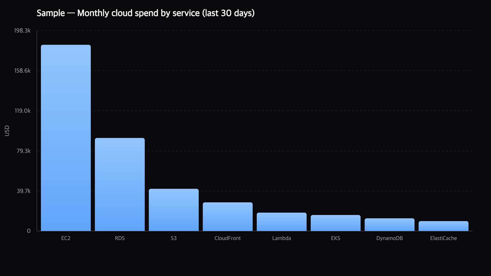
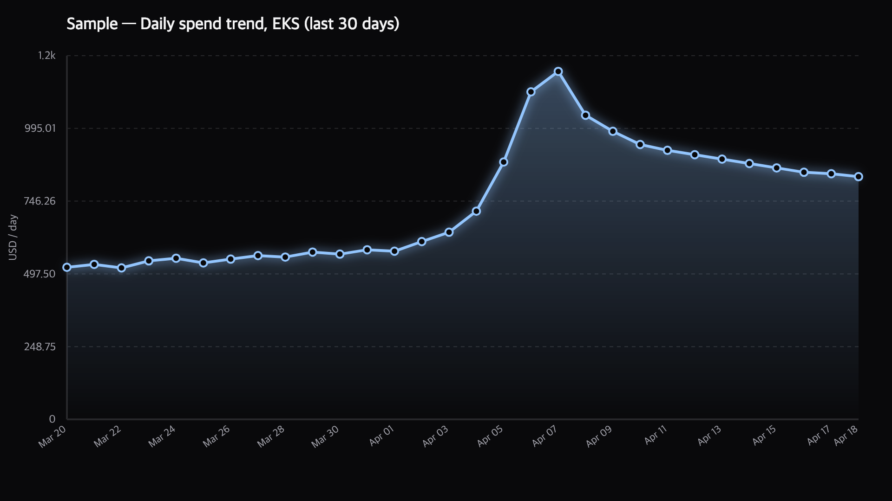
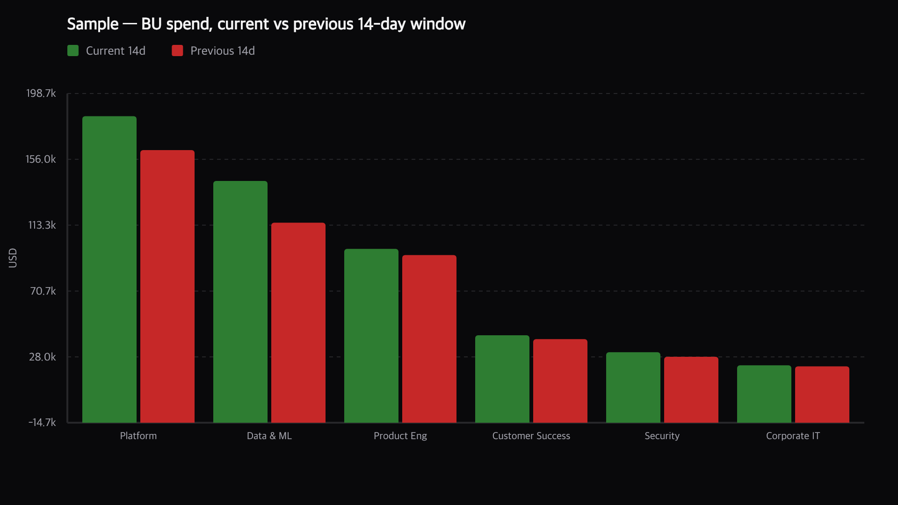
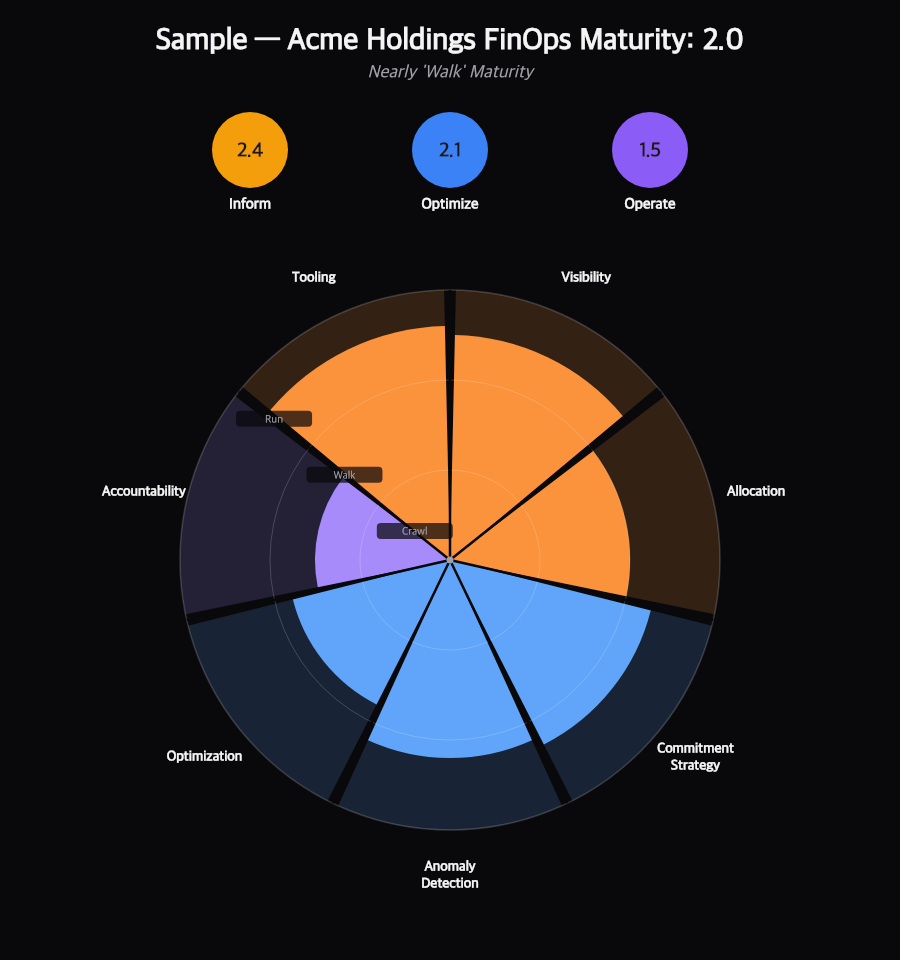

## How to read this report

This document has two parts:

1. **Part 1 — Feature samples.** A gallery of the deliverables the agent can produce, each with a representative sample. Use this to answer *"what can the agent actually make for me?"*
2. **Part 2 — Prompt library.** A tool-by-tool reference with 2–4 example prompts for every MCP function. Use this to answer *"how do I ask it to do that thing?"*

All sample charts and diagrams in Part 1 were rendered **by the agent itself**, using the same tools you are about to read about. No external design system, no separate BI dashboard.

Please note a subset of these features are in active development to be supported by the official Harness MCP Server.

::: metrics
- label: Feature families
  value: "8"
  trend: Charts → Maturity → BVR → Training → Live reports → Video
  tone: success
- label: MCP tools
  value: "12"
  trend: Plus curriculum + guide
  tone: info
- label: Themes
  value: "4"
  trend: harness / modern / glass / kinetic
  tone: info
- label: Export formats
  value: "3"
  trend: HTML · PDF · narrated MP4
  tone: success
:::

---

# Part 1 — Feature samples

---

## 1. Charting

The agent renders PNG charts locally (no external service, no image upload) and embeds them inline in chat. Three chart shapes cover >95% of FinOps questions.

### 1.1 Bar chart — rankings and breakdowns

**Use for:** top-N service / account / BU / SKU breakdowns.



```json
{
  "tool": "harness_ccm_finops_chart",
  "chart_spec": {
    "kind": "bar",
    "title": "Monthly cloud spend by service (last 30 days)",
    "y_label": "USD",
    "points": [
      { "label": "EC2", "value": 184300 },
      { "label": "RDS", "value": 92100 },
      { "label": "S3",  "value": 41800 }
    ]
  },
  "chart_size": "large"
}
```

### 1.2 Line chart — trends over time

**Use for:** daily / weekly / monthly spend trajectories, forecasts, anomaly context.



The shape above is a textbook cost spike: a flat baseline, a three-day ramp, a peak, then a slow decay. The agent's spike-investigation workflow (§6 of the guide) starts exactly from a chart like this.

### 1.3 Grouped bar chart — period-over-period comparison

**Use for:** "current vs previous" deltas, BU vs BU, budget vs actual.



The **`harness_ccm_finops_cost_category_chart`** tool produces this shape automatically for any cost category — you pass `perspective_id` + `cost_category_name` and the agent runs the two windowed queries and renders the comparison in a single call.

---

## 2. FinOps Maturity Report

A **Crawl / Walk / Run** assessment across seven dimensions mapped to the three FinOps Foundation groups (**Inform · Optimize · Operate**). The agent scores each dimension from your live CCM data, renders the segmented-circle chart, and writes a themed HTML/PDF narrative alongside it.

### Sample spider chart



### Sample narrative (excerpt)

```markdown
---
title: FinOps Maturity Assessment
customer: Acme Holdings
docType: Maturity Report
date: April 18, 2026
---

::: metrics
- label: Overall score
  value: "2.0 / 3.0"
  trend: Nearly Walk
  tone: info
- label: Strongest dimension
  value: Tooling (2.6)
  trend: CCM + CO + AutoStopping adopted
  tone: success
- label: Biggest gap
  value: Accountability (1.5)
  trend: No chargeback enforced
  tone: risk
:::

## Where Acme is today

Acme has invested heavily in the **Inform** group — visibility and tooling
are both approaching Run (2.5 / 2.6). Cost perspectives cover 100% of
cloud spend and every BU has a named owner.

::: success Commitment Strategy (2.3) — above industry median
Reserved Instance + Savings Plan coverage sits at 62%, utilization at 94%.
The gap to Run (3.0) is additional OnDemand workloads that could move to SP.
:::

::: risk Accountability (1.5) — the single biggest blocker
No BU has a monthly chargeback review on the calendar; budget breaches
trigger Slack alerts but no escalation path. Until accountability reaches
Walk, further investment in Optimize dimensions returns <50¢ per dollar.
:::

## Path to Walk by Q3

::: action 90-day plan
- Instrument the top 6 BUs with monthly budget reviews (accountability)
- Enable Commitment Orchestration auto-purchase (commitment_strategy → 2.8)
- Turn on AutoStopping on non-prod K8s (optimization → 2.2)
:::
```

### How it's produced

1. The agent pulls live CCM data: perspective coverage, budget health, RI/SP coverage + utilization, anomaly volume, AutoStopping adoption, recommendation backlog, tag hygiene.
2. It applies the scoring rubric in §17 of the agent guide to derive each of the seven scores.
3. It renders the spider chart with `harness_ccm_finops_maturity_chart`.
4. It authors the markdown narrative (above) and registers it with `harness_ccm_finops_report_render`, returning a live URL you can share, export to PDF, or re-theme.

---

## 3. Business Value Review (BVR)

A **quarterly or on-demand** customer-facing deliverable that combines a maturity score, per-module deep-dives, expansion signals, and an action plan into a single themed document. Typical length: 20–40 pages.

### Sample cover page (rendered)


### Sample section excerpt — "Commitment Orchestration"

```markdown
## Commitment Orchestration

::: metrics
- label: Coverage (30d)
  value: "62%"
  trend: "+4% vs last quarter"
  tone: success
- label: Utilization
  value: "94.1%"
  trend: Above 80% benchmark
  tone: success
- label: Realized savings
  value: "$1.87M / year"
  trend: From RI + SP commitments
  tone: success
- label: Unused hours
  value: "8,420"
  trend: All in us-east-1 RDS
  tone: warning
:::

### What's working

Acme's SP-first strategy is paying off: 73% of compute savings come from
Savings Plans, which auto-apply across EC2 / Fargate / Lambda and removed
the instance-family exposure RIs used to carry.


::: warning RDS RI waste
The 8,420 unused hours are all `db.m5.xlarge` RIs in `us-east-1`. Two
options: (1) modify to a smaller family via the RI marketplace, or
(2) let the agent enable Commitment Orchestration auto-purchase to
rebalance next quarter.
:::

::: action Recommended next step
Enable `harness_ccm_finops_commitment` auto-purchase on the `us-east-1`
payer account. Projected incremental savings: $340K / year.
:::
```

### Sample module table (from a BVR)

| CCM Module             | Adoption | Realized monthly value | Next step              |
|------------------------|----------|-----------------------:|------------------------|
| Cost Visibility        | Run      | — (table-stakes)       | Tag hygiene pass       |
| Commitment Orchestration | Walk    | $156K / mo             | Enable auto-purchase   |
| AutoStopping           | Walk     | $42K / mo              | Roll out to K8s        |
| Cluster Orchestrator   | Crawl    | $0                     | Pilot on dev clusters  |
| Asset Governance       | Walk     | $88K / mo              | Close 34 open recs     |
| FinOps Agent           | Walk     | (this report)          | Weekly exec briefing   |

### How it's produced

The full BVR playbook lives in §19 of `harness_ccm_finops_guide`. In short:

1. Bootstrap → discover cost categories → run section queries → generate chart PNGs into `assets/` → author markdown → `harness_ccm_finops_report_render` → share URL or export PDF.
2. The same markdown can be rendered in **four themes** — the customer sees the polished `harness` theme, internal reviewers often prefer the denser `modern` theme, and `kinetic` is used for the interactive web walkthrough.

---

## 4. FinOps Training (Curriculum)

The agent ships a **FinOps Fluency** curriculum — seven 5–10 minute lessons that use the customer's live data as the teaching material. Each lesson follows the same five-beat rhythm: **Hook → Zoom → Reveal → Pattern → Practice**.

### The seven lessons

| # | Lesson title            | FinOps group | Primary data source           |
|---|-------------------------|--------------|-------------------------------|
| 1 | Cost Visibility         | Inform       | `cost_breakdown`, `cost_summary` |
| 2 | Allocation & Chargeback | Inform       | `cost_category`, perspectives    |
| 3 | Commitments             | Optimize     | `cost_commitment_*`              |
| 4 | Anomalies               | Optimize     | `cost_anomaly`                   |
| 5 | Right-sizing            | Optimize     | `cost_recommendation`            |
| 6 | Budgets & Forecasts     | Operate      | `cost_budget`, `budget_health`   |
| 7 | Maturity                | All          | `maturity_chart`                 |

### Sample lesson excerpt — "Lesson 4: Anomalies"

```markdown
---
title: "Lesson 4 — Anomalies"
subtitle: "From surprise to signal in three queries"
customer: Acme Holdings
docType: FinOps Lesson
---

## Hook

::: critical $84,200 spent on nothing
Last Thursday, RDS spend jumped from $1.2K/day to $8.6K/day in us-east-1.
A new Aurora cluster was spun up for a demo and never shut down. Total
waste: $84,200 before anyone noticed.
:::

## Zoom


The shape above is the anomaly signature: flat baseline → three-day ramp →
peak → slow decay. The agent flagged it 41 hours after the ramp began.

## Reveal — the three-step investigation pattern

1. **`cost_anomaly_summary`** — is anything flagged?
2. **`cost_anomaly` list** — rank by $ impact.
3. **`cost_anomaly` get** — full detail, including probable root cause.

## Pattern — your shape vs the Acme shape

Anomalies almost always follow one of three shapes:
- **Spike** (Aurora demo → ramp → peak → decay)
- **Step** (new service switched on → flat at higher baseline)
- **Drift** (slow creep, no single cause, usually tag sprawl)

## Practice

::: action Try this on your own spend
Ask: "Are there any active cost anomalies in the last 7 days?
What's the dollar impact and which BU owns each one?"
:::
```

### How it's produced

- **Curriculum source of truth:** `harness_ccm_finops_curriculum` returns the full lesson-generation playbook.
- **Output:** one themed markdown per lesson + inline chart PNGs. Rendered via `harness_ccm_finops_report_render` exactly like a BVR, or narrated as MP4 via `harness_ccm_finops_video_render`.

---

## 5. Live-rendered, themed reports in the browser

Every report the agent authors — BVRs, maturity assessments, lessons, monthly reviews, ad-hoc triage docs — is published with a **single tool call** to `harness_ccm_finops_report_render`. The tool returns a live browser URL that serves the markdown as a themed HTML document. Four themes ship in the box; the reader can switch between them from the sidebar without re-running the tool, and can export the current theme to PDF with one click.

### What you get from one `report_render` call

- **Live URL** (`http://localhost:3000/reports/<id>/`) that auto-opens in your default browser.
- **Sidebar TOC** derived from markdown headings.
- **Theme picker** — live swap between `harness`, `modern`, `glass`, `kinetic`.
- **Print-quality PDF** via the same pipeline used for the narrated video capture.
- **Relative asset serving** — any `` reference in the markdown resolves off the same directory tree, so your chart PNGs, diagrams, and screenshots "just work" without a separate build step.

### Theme gallery

Exactly the same markdown rendered in all four themes:

#### Harness Executive — the default


Navy + amber with Fraunces serif. Formal, customer-facing. This is what goes into a quarterly BVR that lands in the CFO's inbox.

#### Modern Editorial


Near-black + coral with Space Grotesk. Denser, bolder, more editorial. Preferred for internal reviews, exec dashboards, and when the content needs to feel current rather than corporate.

#### Liquid Glass


Iridescent peach / violet with translucent panels. High-visual-impact for launch-style showcases and customer events. The panel chrome adapts to whatever content you put behind it.

#### Kinetic Editorial


Near-black + lime + coral with Bricolage Grotesque. Functional motion and scrollytelling — designed for interactive web viewing rather than PDF-first delivery. Use this when you're demoing the report live or walking an audience through it.

### How theming works

All four themes consume the same `.md` source and the same asset tree. The difference is **entirely** in the theme bundle loaded at render time:

```text
src/report-renderer/static/themes/
├── harness/     theme.css + print.css + app.js
├── modern/      theme.css + print.css + app.js
├── glass/       theme.css + print.css + app.js
└── kinetic/     theme.css + print.css + app.js
```

The authoring vocabulary (`:::critical` / `:::success` / `:::risk` / `:::action` / `:::info` / `:::warning` callouts, `::: metrics` grids, tables, footnotes, task lists, code blocks, figures) maps to the same HTML structure regardless of theme — every theme styles those classes its own way. That means you **never rewrite markdown** to change the look: author once, re-theme for any audience.

### Example prompts

> "Render the Acme Q2 BVR in the harness theme and open it in my browser."

> "Preview the FinOps lesson on commitments in the kinetic theme instead."

> "Export the current maturity report to PDF."

> "Register the triage doc with id `acme-incident-apr18` so the URL is stable and I can share it."

### How it's produced

`harness_ccm_finops_report_render` is a thin wrapper around an in-process Express app:

1. The tool registers the markdown file in an in-memory registry and returns the URL.
2. On each browser request, the renderer re-reads the markdown (so edits during an active session pick up on reload), runs the preprocessors (`::: metrics`, `<!-- voice: -->`, callouts) **with code fences protected**, feeds the result through markdown-it, and injects the requested theme bundle.
3. The PDF export uses Playwright to print the print-view of the current theme — the same capture path that drives the narrated video pipeline.

No second service, no static-site generator, no CSS to hand-write. Adding a fifth theme is a directory-drop: put `theme.css` / `print.css` / `app.js` under `src/report-renderer/static/themes/<id>/` and it appears in the sidebar picker.

---

## 6. Narrated video briefings

Every report the agent authors can be **rendered as a narrated MP4** with zero extra authoring. Voice narration lives inside the markdown as `<!-- voice: ... -->` HTML comments — invisible to the HTML/PDF viewer, picked up by the video renderer.

### Sample narration pattern

```markdown
## Commitment Orchestration

<!-- voice:
Acme's Commitment Orchestration coverage reached sixty-two percent
this quarter, up four points. Utilization held at ninety-four percent,
well above the industry benchmark of eighty. Realized savings
crossed one point eight seven million dollars annualised.
-->

::: metrics
- label: Coverage (30d)
  value: "62%"
...
```

Per-comment overrides let you pick a different voice or speaking rate for a specific slide:

```markdown
<!-- voice voice="nova" rate=1.05:
Quick aside — the eight thousand four hundred unused hours you see
below are all RDS, not EC2. RDS does not auto-apply across family
the way EC2 Savings Plans do.
-->
```

### Output characteristics

- **1920×1080 H.264 MP4** by default.
- One slide per Paged.js page, durations matched to narration length.
- Optional cross-dissolve transitions, subtle Ken Burns zoom, and burned-in SRT captions (paged, 2 lines × ~55 chars, dedicated dark caption bar).
- **Pluggable TTS:** OpenAI, ElevenLabs, Azure, Google Cloud, or any OpenAI-compatible **local** endpoint (Orpheus-FastAPI, Kokoro-FastAPI, LMStudio, …).
- **Content-hash audio cache** — re-rendering a report only re-calls TTS for narration that changed.

---

## 7. Budget health sweep

A single call (`harness_ccm_finops_budget_health`) produces a classified risk assessment across every budget in the account: **over budget · at risk · on track**, with `pct_actual`, `pct_forecast`, and projected overrun per budget.

### Sample excerpt (rendered)


Typical usage is a Monday-morning exec briefing: one call → three ranked groups → a chart → done.

---

## 8. AutoStopping & Commitment dashboards

The agent ships dedicated resource types for AutoStopping (`cost_autostopping_rule`, `cost_autostopping_savings`, `…_logs`, `…_schedule`) and Commitment Orchestration (`cost_commitment_*`). One call returns structured JSON; a chart renders from that JSON in a second call.

### Sample AutoStopping daily savings


### Sample Commitment coverage breakdown


---

# Part 2 — Prompt library

A tool-by-tool reference. Every tool listed is a real MCP function exposed by the FinOps agent — copy the prompts verbatim or adapt them.

::: info Placeholder convention
Prompts in `[square brackets]` need your values. Start any session with *"List all our cost categories and cost perspectives"* and the agent will return the real names to substitute in.
:::

---

## Tool 1 — `harness_ccm_finops_guide`

**What it does.** Returns the complete agent operating guide (tool calling conventions, resource types, group-by dimensions, time filters, spike/anomaly patterns, BVR + maturity + training playbooks).

**Value.** Any LLM client that loads this guide into context gets turn-key FinOps competence — no hand-written system prompt, no per-customer tuning.

**Example prompts:**

> "Load the full FinOps agent guide."

> "Remind me of the BVR playbook."

> "Show me the cost-spike investigation pattern."

---

## Tool 2 — `harness_ccm_finops_list`

**What it does.** The primary query tool. Dispatches to any registered resource type (20+), with consistent parameters: `resource_type`, `perspective_id`, `group_by`, `time_filter`, `filter_*`, `business_mapping_name`, `limit`.

**Value.** Replaces 10+ per-endpoint client calls with one deterministic interface. Pagination, search, BU filtering, period comparison (`costTrend`) — all built in.

**Example prompts:**

> "Show me a cost breakdown by GCP project for the last 30 days, with trends."

> "List all cost anomalies flagged in the last 7 days, sorted by dollar impact."

> "What are our top 10 open cost recommendations across all clouds?"

> "List every cost perspective, and tell me which has the most spend attached."

---

## Tool 3 — `harness_ccm_finops_get`

**What it does.** Returns full detail for a single resource by ID — a specific budget, recommendation, cost category, commitment portfolio, or anomaly.

**Value.** Drill-down without re-querying the whole list. Follows naturally from `list` + a ranked top-N.

**Example prompts:**

> "Get the full detail on the `platform-q2` budget."

> "Show me the full rules for the `Business Units` cost category."

> "Get the root-cause summary for anomaly `anom_17a9f`."

---

## Tool 4 — `harness_ccm_finops_describe`

**What it does.** Returns local metadata: what resource types exist, what operations each supports, what fields it exposes. **No API call.**

**Value.** The agent's own self-discovery tool. If the model doesn't know whether a resource supports `group_by: awsRegion`, it asks `describe`.

**Example prompts:**

> "What resource types are available in the CCM toolset?"

> "Describe `cost_recommendation` — what fields and filters does it support?"

---

## Tool 5 — `harness_ccm_finops_json`

**What it does.** Shape-normaliser for any CCM JSON blob. Takes raw API output, returns the canonical `{ points: [...] }` shape that the chart tool consumes.

**Value.** Skip hand-writing chart specs. Pipe `list → json → chart` and the chart Just Works regardless of which GraphQL shape the resource returned.

**Example prompts:**

> "Normalize this cost_breakdown response for charting."

*(This tool is mostly invoked internally by the agent — end users rarely call it directly.)*

---

## Tool 6 — `harness_ccm_finops_chart`

**What it does.** Renders a local PNG from a `chart_spec` (`bar` · `line` · `grouped_bar`) or from a `ccm_json` string. Returns `image/png` inline plus an optional disk write.

**Value.** Every FinOps answer gets a chart. Deterministic (same input → same PNG), offline (no external service), consistent branding across all report themes.

**Example prompts:**

> "Chart the top 10 AWS services for the last 30 days as a bar chart."

> "Render a line chart of daily EKS spend for the last 60 days."

> "Make a large-size bar chart of BU spend and save it to `/path/to/report/assets/bu.png`."

---

## Tool 7 — `harness_ccm_finops_cost_category_chart`

**What it does.** Renders a **grouped-bar** PNG comparing every bucket of a cost category across two consecutive UTC windows. Runs the two period queries for you and renders current (green) vs previous (red).

**Value.** The single most common BVR chart — "How did each BU change quarter over quarter?" — condensed to one tool call.

**Example prompts:**

> "Show me current vs previous 14-day spend for every bucket in the `Business Units` category."

> "Render a quarter-over-quarter chart for the `Teams` cost category on the `AWS Default` perspective."

---

## Tool 8 — `harness_ccm_finops_maturity_chart`

**What it does.** Renders the seven-dimension Crawl / Walk / Run spider chart plus a JSON summary (per-group sub-scores, overall score).

**Value.** One tool, one PNG, zero design work — the maturity deliverable the Foundation asks for, ready to paste into any customer doc.

**Example prompts:**

> "Assess our FinOps maturity and render the spider chart."

> "Score our maturity across all seven dimensions — visibility 2.5, allocation 2, commitments 2.3, anomalies 2.2, optimization 1.8, accountability 1.5, tooling 2.6."

---

## Tool 9 — `harness_ccm_finops_budget_health`

**What it does.** One-call classified risk sweep: `over_budget`, `at_risk`, `on_track` groups with `pct_actual`, `pct_forecast`, and projected overrun amounts per budget.

**Value.** Replaces a manual 5-query budget-review workflow. Perfect for Monday-morning exec briefings and the "budgets" section of every BVR.

**Example prompts:**

> "Run a budget health sweep across every budget in the account."

> "Which budgets are at risk this month? Rank by projected overrun."

> "Show me only MONTHLY budgets over $50K and classify them."

---

## Tool 10 — `harness_ccm_finops_curriculum`

**What it does.** Returns the complete FinOps Fluency curriculum — the five-beat teaching rhythm, lesson anatomy, and per-lesson specifications for all seven lessons.

**Value.** Turn-key training content. Any LLM client that loads this can generate a branded, data-driven lesson for any of the seven FinOps dimensions, in any theme, in <2 minutes.

**Example prompts:**

> "Load the FinOps curriculum."

> "Generate Lesson 4 (Anomalies) for Acme using our live data."

> "Produce all seven lessons as narrated MP4s for our next customer workshop."

---

## Tool 11 — `harness_ccm_finops_report_render`

**What it does.** Registers a markdown file with the in-process report renderer, returns a live browser URL. User can switch themes live and click **Export PDF**.

**Value.** Publishing a BVR, maturity report, or lesson is a **single tool call**. No static-site generator, no CSS to write, no PDF pipeline to maintain.

**Example prompts:**

> "Render `/path/to/acme-q1-bvr.md` in the harness theme and open it in my browser."

> "Register this lesson as a pinned URL with id `acme-anomalies-lesson`."

> "Preview the report in the `kinetic` theme instead."

---

## Tool 12 — `harness_ccm_finops_video_render`

**What it does.** Renders any registered markdown as a narrated **1920×1080 H.264 MP4**. Uses `<!-- voice: ... -->` HTML comments as per-slide narration; stitches PNG + MP3 per page with optional cross-dissolves, Ken Burns, and burned-in captions.

**Value.** Every BVR, maturity report, and lesson becomes an asynchronous customer briefing — no screen recorder, no manual editing, no voice actor booking. Re-render after a data refresh and the **audio cache** skips TTS for narration that hasn't changed.

**Example prompts:**

> "Render the Acme BVR as a narrated MP4 in the harness theme."

> "Produce a video of Lesson 3 (Commitments) using the local TTS server and cross-dissolve transitions."

> "Re-render the video — only the budget section changed, so cache the rest of the audio."

---

## Tool 13 — `markdown_to_pdf`

**What it does.** Non-rendered-report PDF export. Converts any markdown file to PDF via the same Playwright pipeline the report renderer uses.

**Value.** Useful when you want a themed PDF but don't need the live HTML preview (e.g. a batch overnight job).

**Example prompts:**

> "Convert `/path/to/report.md` to PDF at `/path/to/report.pdf`."

---

# Appendix — common multi-tool workflows

The highest-leverage prompts chain several tools together. These examples are **one prompt each** — the agent orchestrates the tool calls.

### A. Spike investigation

> "Our GCP bill jumped 35% in the last week. Show me when it started, which project caused it, and which SKU is driving the dollars — with charts."

*Chains:* `list (cost_metadata)` → `list (cost_timeseries, product)` → `list (cost_breakdown, gcp_project_id)` → `list (cost_breakdown, gcp_sku_description)` → `chart` × 3.

### B. Full BVR for a customer

> "Author a Q2 BVR for Acme Holdings covering visibility, commitments, AutoStopping, governance, and the FinOps Agent. Score maturity, render all charts, and give me the preview URL."

*Chains:* bootstrap → cost queries for each section → `maturity_chart` → `chart` × N → author markdown → `report_render`.

### C. Narrated lesson series

> "Generate all seven FinOps Fluency lessons for our onboarding academy, narrated, with captions, using the local TTS server."

*Chains:* `curriculum` → `list (per-lesson data)` → `chart` × N per lesson → author 7 markdown files → `report_render` → `video_render` × 7 with `tts_provider: local`.

### D. Weekly exec briefing

> "Run a budget health sweep, list any active anomalies over $10K, and render both as a single 2-page report I can forward to the CFO."

*Chains:* `budget_health` → `list (cost_anomaly)` → `chart` × 2 → author markdown → `report_render`.

---

::: success End of report
You have now seen every deliverable shape the FinOps agent can produce and the prompts that trigger each one. The fastest way to try this is to copy the prompts from **Part 2** verbatim — the agent will ask follow-up questions to fill in your specific perspective / BU / date range.
:::
